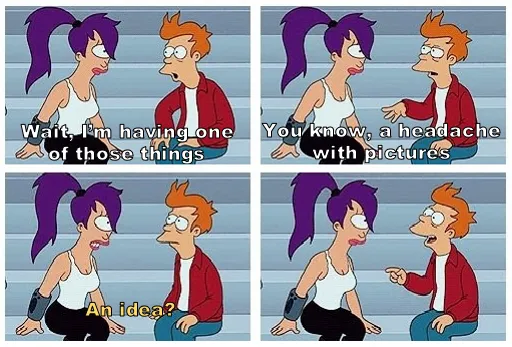

+++
title = "Just Do Something Already"
description = "A post where I talk about overcoming fear and self-doubt to turn ideas into action"
date = 2024-11-18
+++

> This is a repost of an article I originally published on Medium in November of 2020. I'm moving it here to consolidate all my writing in one place.

Have you had an idea? A deep seated conviction that things could be better? That _you_ could bring about that change for the better?
But, on the other hand, has your idea been with you for years with nothing to show for it? Have you seen others bring about their ideas? Maybe you have even tried a few times to do the same but haven’t or couldn’t? Then I’m writing this for _you_.

This is the story of an idea ([**Gradely**](https://gradely.pages.dev/), use `bali5more` as a key to test). It is not a success story in which I tell you how you should do things just the way I did them and that success is “guaranteed.” It is not a failure story either in which I reflect on all the things I did wrong and what I learned from the experience. It is the story of the ongoing struggle of being stuck, and now finally doing something about the idea!

You see, I believe that many of us have thought about doing something, but are paralyzed by a myriad of excuses and factors, thinking that we don’t have what it takes and just conforming to do nothing. And I want to convince you otherwise!

> I have always thought that one man of **tolerable abilities** may work great changes, and accomplish great affairs among mankind… -Benjamin Franklin

## The entrepreneurship bug

I don’t know the exact circumstances that lead a person to believe that _they_ can bring about change, that _li’l ol’ me_ can do something of value, but I can share how it happened to me.

In 2012, I started a masters degree in leadership/philosophy and got a work-study position for the department of distant education of my school. I had never worked before in tech but ever since I can remember I have been involved with it. From breaking my mom’s irons to see what was in there (…I didn’t know about screwdrivers back then!), to building a crystal radio and experiencing the magic of “the waves,” to going down the Linux train, to electronics and more. I got my hands on whatever books I could and tried all kinds of tech things even from my childhood.

Thus, I had no _“official”_ qualifications for that job except what I had learned and the crazy notion that if I came across something I didn’t know, I could just learn it. Nowadays I just say that **everything is _figureoutable_.** But I digress.

It was at that job that I heard how much the university was paying for a service. I was appalled! The software that they were paying for was open-source/free and that meant that they were pretty much just paying for servers! To my naive mind it sounded like I could provide those services, charge them half what they were paying and with 4–5 clients I would be set for life! And just like that I was bitten by the entrepreneurship bug and have been affected ever since.

From there the idea narrowed down to a general _“I want to do something with technology for education”_ to _“I want to build a gradebook that doesn’t suck!”_ But it would be years before anything happened.

## And then… what?

And then… I did nothing. Well, not _nothing_ nothing. I Googled about how to start a business… and was inundated by the overwhelming amount of information that I found. It wasn’t just the sheer volume but how all-over-the-place it was. There were stories of _successful_ people that had found success doing the complete opposite things! I heard that they way to go was with sponsors (and spent $500 on a course to learn more about it). I heard that the way to go was with an accelerator and VCs. I heard that they way to go was being bootstrapped. I heard that B2B was king, that B2C has more volume and market… I read and read and read, maybe 30+ books, listened to a bunch of podcasts, read blog posts, HN stories, etc. etc.

But one thing was true during all of this: **I never felt ready.** It seemed to me that the people doing these things, starting organizations and business, bringing about change, had it all together. I thought these people just knew what to do and did it.

And here I was with an idea that I had tried to bring to fruition multiple times, that I had talked over with many educators and received good feedback, and yet… nothing. Here I was with _“tolerable abilities”_ to build said idea and still I had done nothing, still felt unprepared, still felt _unworthy_ if you may. How dare I think I could bring about change?! How dare I think people would listen to me?! And for 8 years I was stuck in that quicksand.

And then it hit me. I could spend the next eight years in that quick sand, with the dreaded “what if” question festering in my mind, or I could _just do something already!_ And it was that question that revealed the culprit that had been holding me back. It was not a lack of technical skills, or the lack of some intrinsic personality trait, or some genetically bestowed advantage. No, the culprit was fear, plain raw simple old fear. Fear that whatever I do won’t matter. Fear that the people I wanted to serve would reject me. Fear that all I could do was spend another eight years doing what I had done - nothing - and in the end accomplish nothing. Fear fear fear…

---

Oh, such an old enemy, but how well it still fools us! How well it masquerades itself and blames _us_ for its deficiencies!

When I finally realized all the fear I had and started looking around and listening, I was surprised by what I heard. Everybody else was also afraid!! My boss was afraid, the CEO of the company was afraid, the entrepreneur that I so admired was also afraid!

But you know what? It is those that tell their fears to shut up who are the ones that bring about change! The ones who take their ideas and make them a reality and make the world, even if only a little, a better world!

And here you are reading my feeble attempt to tell my feats to shut up. My attempt at believing that _li’l ol’ me_ can bring about a change, can make a difference in the lives of those I want to serve. That _I_ can make the world, even if only a little, a better world.

And it is my strong belief that _you_ can too! I don’t know your circumstances, your fears, your challenges, but I do believe that you can overcome them as those before you have done. I believe in you and I want you to believe in you, too!

And then there’s this quote by Teddy Roosevelt…

> “It is not the critic who counts; not the man who points out how the strong man stumbles, or where the doer of deeds could have done them better. The credit belongs to the man who is actually in the arena, whose face is marred by dust and sweat and blood; who strives valiantly; who errs, who comes short again and again, because there is no effort without error and shortcoming; but who does actually strive to do the deeds; who knows great enthusiasms, the great devotions; who spends himself in a worthy cause; who at the best knows in the end the triumph of high achievement, and who at the worst, if he fails, at least fails while daring greatly, so that his place shall never be with those cold and timid souls who neither know victory nor defeat.”

## Out there

So this is the beginning of that journey, of _“just doing something about it!”,_ my attempt to put myself out there. What will come of it is still to be seen, but I can tell you this: _“out there”_ the sun is shining! _“Out there”_ the possibilities are endless! _“Out there”_ is still full of dangers and risks, but you can overcome them! _“Out there”_ the world is waiting for you!
