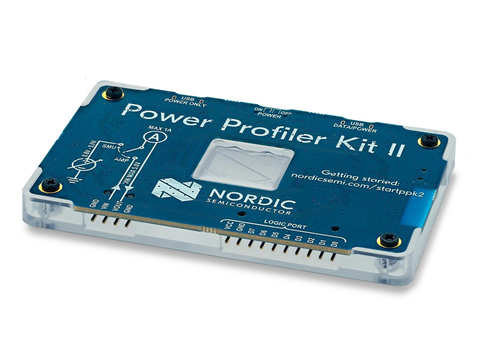

+++
title = "[DRAFT] PPK2 Draft"
description = "Post about learning about communicating with the PPK2"
date = 2025-05-27
draft = true
+++


I have a Nordic Power Profiler Kit II (PPK2) around and for a while I've been curious about how it works, specifically, how it is controlled by software. 


*Power Profiler Kit 2*

The PPK2 is nice little tool that allows you to see how much current a circuit draws. 

To test this we will run a very simple experiment. I have a TINY2040 with Micropython running the following simple script. All that is doing is turning the traversing through the RGB LED, let's see which LED takes 

```python
from machine import Pin
from time import sleep_ms

red = Pin(18, Pin.OUT)
green = Pin(19, Pin.OUT)
blue = Pin(20, Pin.OUT)

def LED(val):
    if val == "R":
        red.value(0)
        green.value(1)
        blue.value(1)
        
    if val == "G":
        red.value(1)
        green.value(0)
        blue.value(1)
        
    if val == "B":
        red.value(1)
        green.value(1)
        blue.value(0)
        
    # White
    if val == "W":
        red.value(0)
        green.value(0)
        blue.value(0)
    
    # Off
    if val == "O":
        red.value(1)
        green.value(1)
        blue.value(1)

while True:
    LED("O")
    sleep_ms(500)
    LED("R")
    sleep_ms(500)
    LED("G")
    sleep_ms(500)
    LED("B")
    sleep_ms(500)
    LED("W")
    sleep_ms(500)
```

This is how this looks:

.

So let's start poking around to see how our computer is talking to the PPK2

### LSUSB


```bash

$ lsusb
# ...
Bus 003 Device 005: ID 1915:c00a Nordic Semiconductor ASA PPK2
# ...
```

After identifying our device we can get more info using the vendor id and device id


```bash
$ lsusb -v -d 1915:c00a

Bus 003 Device 005: ID 1915:c00a Nordic Semiconductor ASA PPK2
Negotiated speed: Full Speed (12Mbps)
Device Descriptor:
  # ...
  bcdUSB               2.00
  # ...
  idVendor           0x1915 Nordic Semiconductor ASA
  idProduct          0xc00a PPK2
  # ...
  Configuration Descriptor:
    # ...
    bmAttributes         0xc0
      Self Powered
    MaxPower              100mA
    Interface Descriptor:
      # ...
      bFunctionClass          2 Communications
      bFunctionSubClass       2 Abstract (modem)
      # ...
    Interface Descriptor:
      # ...
      bInterfaceClass        10 CDC Data
      # ...
```

There quite a bit of information there but the gist of it seems to be that the PPK2 appears to our computer as a CDC device, that is, like serial-to-usb like the FTD chips used in Arduino. This is great because it is quite easy to interface with those devices on Linux!

### `dmesg`

Let's take a look at the out of dmesg when we plug the USB cable


```
#...
[  913.797443] usb 3-3: new full-speed USB device number 6 using xhci_hcd
[  914.085380] usb 3-3: New USB device found, idVendor=1915, idProduct=c00a, bcdDevice= 3.05
[  914.085388] usb 3-3: New USB device strings: Mfr=1, Product=2, SerialNumber=3
[  914.085391] usb 3-3: Product: PPK2
[  914.085393] usb 3-3: Manufacturer: Nordic Semiconductor
[  914.085396] usb 3-3: SerialNumber: CD4AEF387F1B
[  914.140566] cdc_acm 3-3:1.1: ttyACM0: USB ACM device
[  914.152473] cdc_acm 3-3:1.3: ttyACM1: USB ACM device
```

Nice! Linux added two new serial devices, `/dev/ttyACM0` and `/dev/ttyACM1`

Now, if there was any way to figure out what is being said over those two ports...

### usbmon & Wireshark

Luckly in Linux we have [`usbmon`](https://docs.kernel.org/usb/usbmon.html) which allows us to sniff USB traffic, which is exactly what we want. Also, we can use Wireshark to very nicely visualize that traffic. Instructions to setup usbmon vary from vary among linux distributions but the previous link provides a pretty good starting point, as well as the Wireshark wiki on [USB Capture Setup](https://wiki.wireshark.org/CaptureSetup/USB)

On opening wireshark there are multiple usbmon options. In our case we are using `usbmon3` since our device is connected to Bus 003 as we learned from `lsusb`


Oh wow, this is quite interesting! First, when plugging the device to the USB port we see a bunch of traffic of the USB port setting itself up. You can see there the strings that we saw in `dmesg` and in `lsusb`.

Next when we select out device on the Power Profiler application we see that the app sends `0x19` and the device responds with some calibration information. From there, its quite interesting to click around the guy and see what actually sends a CDC command and what doesn't. Something that surprised me was that changing the samples per second doesn't send any command to the device. In fact, we can use usbtop to confirm that the same bandwidth is used whether one is collecting 100,000 samples per second or 10.

So we are simply displaying less sampler but the device is doing the same amount of work.

So this is how our operations looks like so far:


```
0x19     :   Get calibration data
0x1101   : Power Supply Mode - Ampere meter
0x1102   : Power Supply Mode - Source meter
0x0c01   : Enable power output ON
0x0c00   : Enable power output OFF
0x0d---- : Set supply voltage to
```

Let's explore a bit more the values after `0x0d`

Let's take a quick look at a few samples:

```
0d0320 -- 800mV
0d03e8 -- 1000mV
0d0ce4 -- 3300mV
0d1388 -- 5000mV
```

If we check these numbers in out trusty numbat calculator we quickly find that those hex are nothing more than the hex representation of mV integer!


Alright! with all of this knowledge, let's implement our very own quick n' dirty 
