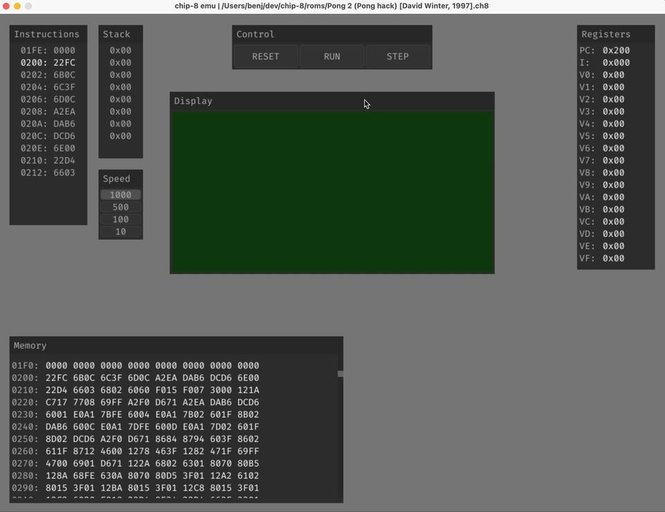
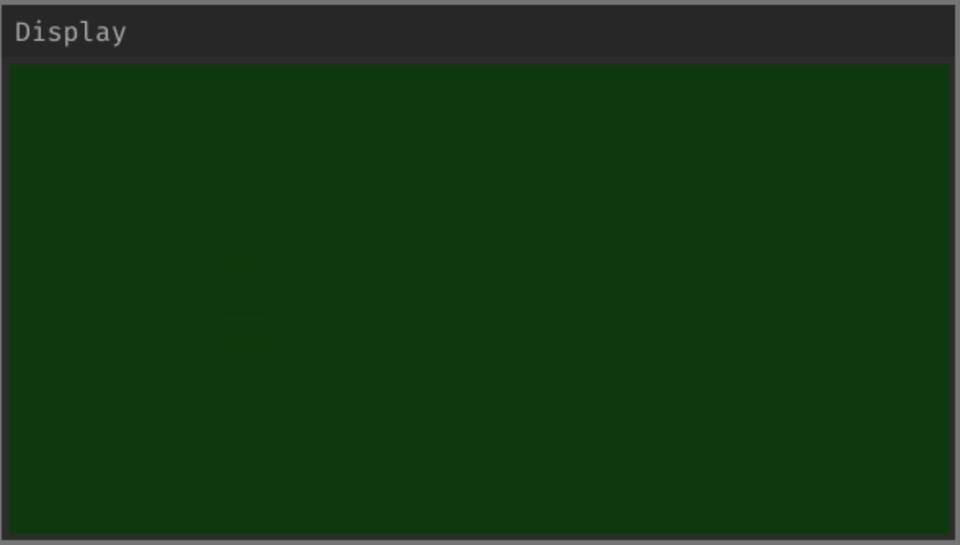
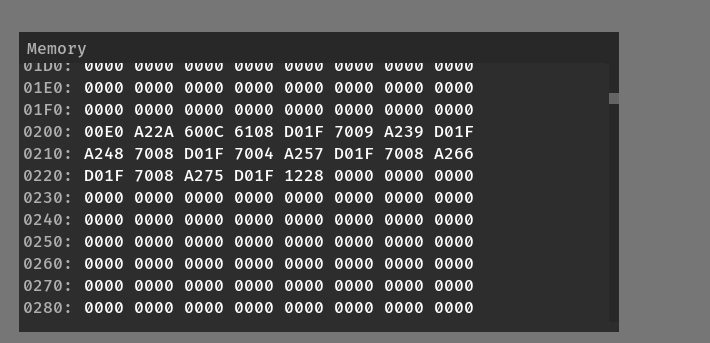
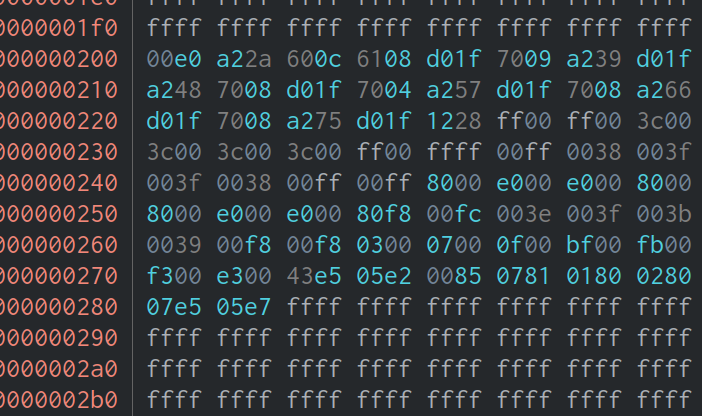
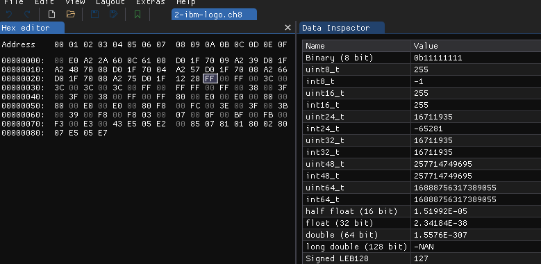

+++
title = "The Adventures of Writing a CHIP8 Emulator - Part 2"
description = "This is the second part of a post about writing a CHIP8 Emulator in C"
date = 2023-06-11
+++


In my last installment of _"How to continually stub your toe with C"_... Uhhh, I mean, [The Adventures of Writing a CHIP8 Emulator - Part 1](/blog/the-adventures-of-writing-a-chip8-emulator-part-1) I took you on my journey of writing a CHIP8 Emulator in C. BTW, here's [the code](https://git.sr.ht/~benjcal/chip8/tree) and a gif of how it looks :-)



Well, I'm now afraid that I might have given you an impression of competency. If that's so, I need to profusely apologize and quickly correct your assumption by pulling the curtain back from that "polished" blog post. The goal with this is simple, if my pain can help you in any way avoid my errors, then my sufferings are not in vain!

### Why clever code == bad code! 🤓🤦‍♂️

One of the first ROMs traditionally used to test a CHIP8 emulator is an old ROM that displays an IBM logo. Here is how that looks rendering at 10Hz:



Yep, CHIP8 is that old! Anyways, the goal was very clear, I only needed to implement a handful of instructions (opcodes) to run that ROM and so I did. I then loaded the ROM and... nothing happened! I looked at my code again, everything looked correct! still, nothing. The output of the CHIP8 is a 64x32 display, so I dumped that to the terminal to see if anything was displaying, nothing. I added `printf` everywhere, added a `scanf()` to step through every instruction, looked at the registers after every instruction, but still nothing. The registers were updating properly, the PC (program counter register) was incrementing correctly, it all was working properly but for some reason the emulator would not work.

I decided to blame the ROM and to look for other beginner ROM to test on my emulator with. After a quick search I came across [this one](https://github.com/Timendus/chip8-test-suite#chip-8-splash-screen) which, when I loaded it on my emulator... worked! But you see, that's terrible news! It showed me that my emulator worked, but only sometimes!? Only for some ROMs!?
It's like if you order your favorite Chipotle burrito, asking for the exact same thing every single time, but you get what you asked for _only_ if you pay with $1 bills on Tuesdays!
Both ROMs were very similar in the instructions they required to operate, so why was it working only on one!?

Well, I proceeded to try everything I could think of. I talked softly and lovingly to my computer... nothing. I talked loudly and threateningly... nothing. I tried to make bargains with my computer... nothing. I changed my compiler flags... nothing. I changed my wallpaper... nothing. Asked my rubber ducky for advice... nothing. Asked ChatGPT for advice... nothing. I bought Sublime Text 4... nothing (in retrospect, Idk how this could have helped, but I still tried it!)

After about two days of no progress at all I came to the conclusion that I would have to take things into my own hands. I'd need to write a debugger for my emulator \*\*dun dun DUN\*\*.

So I did. It was a whole three days detour, which was absolutely fascinating and SO worth it! (But that's a topic for another post.) It was such a success that in the first two minutes of running the half-cooked debugger I was able to see the issue! Mind you, not the cause, but the problem.

Take a look at this screenshot of my debugger showing the bytes currently loaded in memory:



_CHIP8 Emu Debugger Memory Window_

And now take a look at this hexdump ([Cutter](https://cutter.re/)) of the ROM I'm trying to load to memory:



_Cutter hexdump of IBM.ch8_

Do you see the difference? Look, I might not pay attention to details, like the milk I picked up at the grocery store, and just pick up the "red box with cursive letters" only to realize that it's the milk I don't like (true story!)... But I've spent A LOT of time staring at the back of breakfast cereal boxes, so, I've gotten pretty good at "spot the difference" games, if I say so myself... and, my emulator is missing data! What gives!? And the annoying part is that it only happened with the [IBM ROM](https://github.com/Timendus/chip8-test-suite#ibm-logo)! 🤦‍♂️

Well, at least now I know _how_ my emulator doesn't work... it's not reading the whole file! Let's take a look at the function that loads the ROM file to memory:

```c
void chip8_load_rom(Chip8 *chip8, char *path, uint16_t offset) {
    FILE *f = fopen(path, "r"); // open path as readonly

    int8_t b; // temporary byte to store read data
    uint16_t i = offset; // data is usually loaded with a 0x200 offset
    while ((b = fgetc(f)) != EOF) {
        chip8->memory[i++] = b;
    }
}
```

This is a very simple function. Read one byte from the file, set memory to byte. Repeat until End of File (EOF). See, there's nothing wrong with it! 🤦‍♂️ I mean, it worked for some files but it didn't for others? People complain about segmentation faults, but those are preferable to this!

So I decided to take a closer look at the file that my emulator was having trouble with, and you'll [never believe what I found](https://youtu.be/dQw4w9WgXcQ)!

Take a look above and notice what is the very next byte missing in memory, or where reading the file stopped. On the emulator memory the lasts bytes are `0x1228` and nothing else is read after that. In the ROM the very next byte after that is `0xFF`... Well, that is interesting... Why would my program stop reading when it finds `0xFF`? To confirm this theory I changed that byte with `0xFE` and yep, the emulator read `0xFE` without a problem, all the way to the next `0xFF`! Well well well, the plot thickens!

I then decided to take a look at `getc()` to see if there was something I was missing. And interestingly enough, take a look at what the signature for that function is:

```c
int getc( FILE *stream );
```

Did you notice it? it returns an integer, not a character! The function is called `getc`, presumably for "get character" but it returns an integer... interesting 🤔. So, on a whim I decided to change my `b` variable above to and `int`, and BOOM!, it worked!

Now, why would that be?

Take a look at the problematic byte one more time in [ImHex](https://imhex.werwolv.net/), which conveniently shows us the value of a byte in various data types:



_ImHex_

Did you see it? At the right side, in the data inspector, notice what `0xFF` is as an `int8_t`... it is `-1`! And why would that be relevant? Because `EOF == -1`! 🤦‍♂️

You see, I had some esoteric idea that `EOF` was some magical signal or something that the OS sent my program when the filesystem detected that I had reached the end of a file. NOPE. It's just a plain `-1` (it might be something else in different platforms, that's why `EOF` is used instead of `-1`).

So, this is what was happening, my function would go on merrily, reading my file to memory, one byte at a time. It would come to a byte `0xFF` and be like _"La la la la... oh, what have we here? A `0xFF`? This is obviously `EOF` and thus I'm done here and can go back to picking up berries in the forest for Granny! La la la la..."_

Well, while I don't mind C programs wandering off trails to gather questionable berries for their ancestors in the woods, that is most certainly NOT what I wanted my program to do. But by trying to be clever and setting my variable to be _exactly_ one byte `int8_t`, **I created that bug**.

And that's how, a full 5 days of work and... let me check... ~600 LOC led to changing `int8_t` to `int`!! 😅

So, what is the moral of the story? To not be clever and try to save some imaginary space? (My computer is 64 bit, so a 64 bit operation or a 8 bit operation take the exact same space and time...) To not optimize early, and instead get my program working and look for optimizations later? Are they even necessary? That being sidetracked and spending 5 days in a pet project actually pays off? Well... I don't know what the moral is, but I learned nothing and made the variable a `int16_t`! 😂
